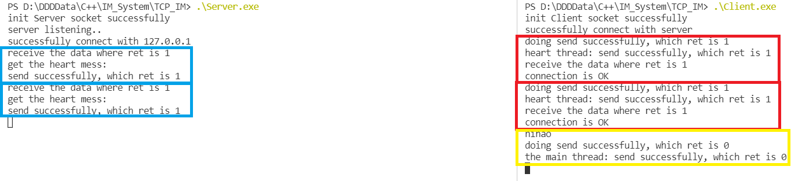

### 即时通信系统设计——C++

----

[TOC]


#### 1、一对一问答系统（TCP/UDP）

- 利用基础的`Server-Client`架构实现，在单线程下完成问答系统的设计


- 设计关键点：

​	1、服务端的接口设置

​	2、客户端的IP地址设置

​	3、监听接收信号

​	4、关闭`socket`的时机


- TCP和UDP的实现区别：

  TCP下的`socket`:

  ```c++
  socket(AF_INET,SOCK_STREAM,IPPROTO_TCP)
  ```

  UDP下的`socket`：

  ```c++
  socket(AF_INET,SOCK_DGRAM,IPPROTO_UDP)
  ```

  

通用模板展示：

```c++
//服务端
class Server
{
    SOCKET server;
    sockaddr_in serverAddr;
    sockaddr_in clientAddr;
    
    public:
    	Server();           //初始化socket和WSA
    	~Server();          //关闭socket和WSA
    	void Init(int);     //初始化服务器的端口等地址信息
    	void Listen();      //监听并接受客户端连接
    	void sendMess();    //发送消息
    	void recvMess();    //接受消息
    	void Close();       //断开连接
    
    private:
    	void Send(string data);
    	void Recv();
};
```


```c++
//Client
class Client
{
    SOCKET client;            //客户端socket
    sockaddr_in clientAddr;   //客户端地址信息
    
    public:
    	Client();             //初始化socket和WSA
    	~Client();            //关闭socket和WSA
    	void Init(string);    //初始化ip地址信息
    	void Connect(int);    //连接服务器指定端口
    	void sendMess();      //发送消息
    	void recvMess();      //接收消息
  		void Close();         //断开连接
    
    private:
    	void Send(string data);
    	void Recv();
};
```


补充：

1、在主函数的首部和尾部加上`WSAStartup(WORD,LPWSADATA)`和`WSACleanup()`

- `WSAStartup`：

  使用示例：

  ```c++
  WORD socketVersion = MAKEWORD(2,2);
  WSADATA wsaData;
  WSAStartup(socketVersion,&wsaData);
  ```

  这个函数有两个作用：1、加载`socket`库；2、进行版本协商

    如果请求的版本高于所支持的版本，那么将会使用二者较小的版本，并将版本信息交给`LPWSADATA`变量；

    如果请求的版本小于所支持的版本，那么将会返回不为0的值

- `WSACleanup()`：

  该函数与`WSAStartup`成对出现，主要用于释放为该应用程序分配的资源

2、使用`recv()`、`send()`函数时，`buffer`的大小应该利用`sizeof()`计算而不是`strlen()`，否则将无法发送或接收


#### 2、一对一聊天系统


##### 2.1实现发送与接收分离

​	通过上面的分析，我们不难看出，在对答系统中，只有等对方发送信息给自己，自己接收到之后才能发送新的信息给对方，在现实中显然这是比较不方便的。

​	我们如何设计一个系统，使得双方能够脱离发送和接收的时间限制，使得二者能随机发送和接收信息呢？

​	目前有一种想法：

​	**将接收放到后台一直运行，将发送放在主线程运行，一旦后台接收到消息就显示出来，发送的时候利用`while`循环实现多次发送的功能**

​	要注意的是每个发送的消息都对应一个接收的函数，也就是说监听的间隔要短，否则短时间内发送两条消息而接收函数只调用了一次，这种情况下很可能会导致系统崩溃。


​	总结以上想法，给出以下代码段：

```c++
//主函数
int main()
{
	Server myServer;         //初始化一个server的类（包括WSAStartup和socket的初始化）
	myServer.InitServer(5005);     //绑定操作
    myServer.connect();            //监听并连接客户端
    thread t(myServer.recvMess()); //启动一个线程用来调用接收信息的函数
    t.detach();                    //将线程分离出来到后台运行
    myServer.sendMess();           //主线程负责发送信息
    return 0;
}
```


​	但是这样做编译器会提示错误，错误为：

```
没有与参数列表匹配的构造函数 "std::thread::thread" 实例 -- 参数类型为:  (void)C/C++(289)
```

​	这是因为C++类成员函数使用时，都会隐式传递一个`this`指针给该函数，`this`指针指向该类的像。函数体通过显式调用该指针或直接访问类内成员

​	回调函数是通过指针调用的函数，最常使用的回调函数就是在创建线程时，以一个函数指针以及传递给这个函数多个参数来调用线程函数来创建线程，那么一般的类成员函数是不能用作回调函数的。

​	因为库函数在使用回调函数时，都会传递指定的符合回调函数声明的参数给回调函数，而类成员函数隐式包含一个`this`指针参数，所以把类成员函数当作回调函数编译时会因为参数不匹配报错。


- 解决方法1：

  把成员函数设为静态成员函数，不属于某个对象，属于整个类，没有`this`指针，但是静态成员函数不能使用非静态的成员变量，可通过对象或者类指针调用。

- 解决方法2：

  把成员函数声明为友元函数，没有`this`指针，但是能够访问类的成员变量

（这里提供不够具体，下面会有另外一种直接将类成员函数作为参数调用的方法）


​	通过利用友元函数的方法对接收函数进行修改，通过以下语句将接收操作放到一个新线程中运行

```c++
//..connect
thread t(recvMess,myServer);
//..sendMess
t.join();
myServer.close();
```

​	但是这种操作下，通信双方都无法正常发送，但是能够正常连接（测试在单线程下能够正常通信），具体原因有待检验。

---

2021 / 7 / 10


2021 / 7 / 14

----

​	通过进一步的检验发现，一旦`recv`放到另外一个线程中运行，在主线程里面是无法发送消息的，如果把`recv`放到主线程中，则能够正常发送和接收。

​	猜想放到另外一个线程这个操作会使原本已经连接好的网络断开，于是尝试在析构函数中加入提示语句，发现服务端输出的顺序是：

```
server listening...
successfully connect with 127.0.0.1
Server has disconnected
you:
```

​	不难得出在成功连接后，又调用了析构函数进行了关闭的操作。

​	通过查找相关资料，现尝试回归到原本的状态下，即不使用友元函数，而是线程直接调用类中的成员函数实现，实现代码如下：

```c++
class Server
{
	...
	public:
		void recvMess();
	...
	private:
		void recv();
};
void recvMess()
{
    while(1)
    {
        if(server == INVALID_SOCKET)
            break;
        recv();
    }
}

int main()
{
    Server myServer;
    ...
    thread t(&Server::recvMess,&myServer);
    ...
    t.join();
    myServer.close();
    return 0;
}
```

分析:

​	一般而言，多线程调用类的成员函数的方法一般为：

```c++
thread t(&类名::函数名,&类对象)
```

​	如果函数中需要传入参数，则在类对象后面加上所要传进的参数。即

```c++
thread t(&类名::函数名,&类对象,参数1,参数2,...)
```


在这种情况下，服务端与客户端都能够正常在终端上面无限制发送和接收，实现了基本的分离操作。


##### 2.2 优化方向

​	在实现好分离操作下，聊天系统已经基本实现完成，但是仍有一些细节需要改进。目前已知的可改进方向有：

- 扩大单次发送和接收消息的长度
- 加入关闭连接操作
- 加入聊天系统的界面
- ....

按照上面的几个要点顺序进行优化：


###### 1）扩大单次发送和接收消息的长度

​	在上面的聊天系统中，每次发送和接收的最大长度为8字节，但是本身设置的可发送和接收的数据是1024字节。

​	通过检查发现，在调用发送消息`send`的接口中，使用的是`sizeof`，而修改成`strlen`后，不再限制为8字节

​	尝试分别利用`sizeof`和`strlen`在接收消息后输出它们的值，得到的结果为

```c++
[Input]你好，这是服务端
[Output(sizeof)]你好，这是
[Output(strlen)]你好，这是服务端
```


> 补充：`sizeof`和`strlen`的区别
>
> - `sizeof`：
>
>   它是一个运算符，结果值是在编译时已经计算好的
>
>   功能是：获得保证能容纳实现所建立的最大对象的字节大小
>
>   由于在编译时计算，因此`sizeof`不能用来返回动态分配的内存空间大小
>
>   **也就是说，`sizeof`的返回值跟对象、结构、数组所存储的内容没有关系，只跟类型有关**
>
>   数组——编译时分配的数组空间大小
>
>   指针——存储该指针所用的空间大小
>
>   类型——该类型所占的空间大小
>
>   对象——对象的实际占用空间大小
>
>   函数——函数的返回类型所占的空间大小。（返回类型不能是void）
>
> - `strlen`：
>
>   它是一个函数，需要在运行时才能计算
>
>   参数必须为字符型指针（char*），且必须以'\0'结尾。
>
>   当数组名作为参数传入时，实际上数组会退化为指针


​	根据上面的区别，我们可以得知，由于将数据作为`send()`的数据传给对端是需要将数据转换为char*，同时需要传入一个数据大小给`send()`。

​	当我们使用`sizeof`时，获取到的只是`char*`这个类型的所占空间的大小而不是内部数据所占大小，不管数据是什么，`sizeof(char*)`的返回值始终是8(64位)/4(32位)。

​	因此当数据所占字节数大于8时，就被`sizeof`截断，传入8字节的数据。我们只需要将`sizeof`改为`strlen`就可以动态获取所要发送数据的大小。


###### 2）加入关闭连接的操作

​	对于终端而言，当前的关闭连接的操作只有通过^C的终端控制符进行。为了能够让双端正常连接和正常关闭，我们需要加入关闭连接的操作

​	但是该聊天系统的主函数已经被发送消息所占据，也就是说，我们无法利用除去发送消息给程序来告知程序关闭连接以外的方法去实现这个操作。因此我们**规定某一特殊指令来作为关闭连接的信号**。

​	具体以特殊指令可以利用以下格式：

```
.\+指令
```

​	如此我们可以拓展终端上面的指令如：

- 显示对端IP地址和端口号
- 断开连接
- 连接到某一服务器
- 退出
- ...


​	但是，这样的聊天系统就被局限在了终端，最终目的主要还是能够设计一个聊天系统界面软件，具体的操作步骤可以利用界面上的`button`进行相应的调用。

​	这里简单实现在终端上关闭连接的操作，但是在实现之前需要考虑一个问题：

​	**在关闭连接后，对端如何知道并且断开当前的连接？**（即实现关闭同步）

​	通过实验发现，如果仅靠判断`socket`是否合法是没有办法真正得知的，因为在关闭连接后，对端仍然可以进行发送的操作，只是发送的时候会返回错误。这里可能需要再对`socket`网络编程相关的API接口熟悉一遍才能知道具体的步骤。


**加入心跳包检测操作**

​	为了能够实现断开连接对端同步，我们可以加入心跳包机制，在连接成功后，客户端新开一个线程隔一段时间发送一个数据包给服务端，如果在一段时间内有收到来自服务端的应答包，那么就说明正常连接；如果没有收到，说明连接已经出现问题。

> 补充(2021 / 7 / 16):
>
> ​	心跳包检测的机制是利用发送接收操作检测连接是否正常，在上面实现的聊天系统中，我们在关闭一端连接时，另外一端同样能发送消息，只是会返回错误信息。但是仅凭返回错误信息去判断连接是否正常还是不够的。
>
> ​	我们还需要结合`errno`去判断所返回的错误属于什么类型，再根据类型去判断连接是否正常
>
> ​	还有一个问题：
>
> ​	如果我们利用发送接收操作进行心跳包检测，那么对端如何知道这是心跳包而不是对端发送的信息呢


​	但是这个操作又引出另外一个问题：

​	**新开的线程通过什么方式告知主线程连接是否正常？**

​	这就需要引出线程间通信的问题，具体需要查阅相关资料才可得知。

- 利用`std::promise`以及`std::future`实现线程间的数据传递

  操作比较简单:

  1、首先定义一个全局`std::promise`变量`promis`

  2、然后在主线程执行`std::future<int> fuResult = promis.get_future()`初始化

  3、在新开的线程中通过`promis.set_value(xxx)`进行对该变量的赋值

  4、在主线程中利用`fuResult.get()`来得到变量的值

  

  示例：

  ```c++
  #include<iostream>
  #include<future>
  #include<chrono>
  #include<thread>
  
  std::promise<int> promis;  //设置数据的类型
  int main()
  {
      std::future<int> fuResult = promis.get_future();
      std::thread t([](){
          std::this_thread::sleep_for(std::chrono::seconds(10));
          promis.set_value(123);
      });
      t.detach();
      std::cout<<"detach.."<<std::endl;
      std::cout<<fuResult.get()<<std::endl;
      std::count<<"get done\n";
      return 0;
  }
  ```

  

  输出结果为：

  ```c++
  detach..
  123      //10秒之后执行
  get done
  ```

  

  分析：

  ​	不难看出如果在主线程中确实能够通过`std::future`的`get()`接口去获取其他线程设置的值，但是这样会导致主线程阻塞。

  ​	我们回归主要问题：加入心跳包机制，我们希望在双端进行发送接收的同时，有一个线程能够在双端每隔一段时间发送和接收数据包检测是否连接正常。因为本身接收操作是在一个新线程中，并且它有连续监听的特性，我们可以在接收循环的同时获取这个变量值，从而判断连接是否正常。
  
  ​	如果是这种方式的话，我们需要对数据进行特殊处理，标识哪个发送的消息是心跳包，哪个发送的消息是用户的信息。我们可以将数据分成两个部分，一个部分是首部，一个部分是数据主体。首部用来识别将要发送的数据属于心跳包还是用户的信息，数据主体用来存储真正的信息。
  
  ​	由于`socket`接口下的`send()`函数可发送的类型为`const char*`，因此我们不可能直接将这个数据结构体直接发送过去，而是需要通过**序列化**的形式将其转化为字符指针，然后在`recv()`接收到`char*`类型之后进行**反序列化**得到传输过来的结构体数据。
  
  ​	序列化可以利用以下类进行操作：
  
  ```c++
  class Serial
  {
  	public:
      	char* data(){return buffer.data();}
      	void WriteInt(int i)
          {
              append(&i,4);
          }
      
      	void WriteString(const string& str)
          {
              WriteInt(str.length());
              append(str.c_str(),str.length());
          }
      
      	void append(void* val,size_t n)
          {
              buffer.append((const char*)val,n);
          }
      private:
      	string buffer;
  };
  ```
  
  
  
  反序列化可以由以下类进行操作：
  
  ```c++
  class UnSerial
  {
  	public:
      	UnSerial(const char* buff):
      		buffer(const_cast<char*>(buff)),pos(0){}
      	int ReadInt()
          {
              int i = *(buffer+pos);
              pos+=4;
              return i;
          }
      	string ReadString()
          {
              int i = ReadInt();
              string s(buffer+pos,i);
              pos += i;
              return s;
          }
      private:
      	char* buffer;
      	int pos;
  };
  ```


结合上面两个类可以在聊天系统中加入心跳包机制，下面为心跳包接口：

```c++
#define HEART_DATA "check"
#define HEART_MESS 0
#define CLIENT_MESS 1

int Server::Send(string data,int signal);

void Server::send_heart()
{
	int time = 0;
    while(1)
    {
        if(Send(HEART_DATA,HEART_MESS) == -1)
        {
            if(time < 5)
            {
                printf("send heart package fail, try to resend it..\n");
                time++;
            }
            else
            {
                printf("connection fail\n");
                return;
            }
        }
    }
}
```


我们利用原有的接收接口来接收心跳包，只需在接收到数据后根据数据的首部判断是否为心跳包即可

```c++
void Server::Recv()
{
	char data[1024];
    int ret;
    while((ret = recv(client,data,sizeof(data))) <= 0)
    {
        Sleep(1);
    }
    
    UnSerial myUnSerial(data);
    int signal = myUnSerial.ReadInt();
    string str = myUnSerial.ReadString();
    
    if(signal == HEART_MESS)
    {
        Sleep(1000);
        Send(HEART_DATA,HEART_MESS);
    }
    else
    {
        printf("Friend:%s\n",str.c_str());
    }
}
```


##### 2.3 实验结果分析

###### 2.3.1 问题排查

​	经过多次的检验与执行，发现虽然心跳包机制能够正常发送和接收，但是接收到的信息只有首部而数据为空。并且用户发送的消息无法被对端接收，而`send()`函数却没有报错。

​	为了能够更好排查问题所在，以下列出几种可能导致的情况，然后再根据这些情况进行逐一检验：

- 序列化和反序列化过程存在问题
- 接收和发送消息传入的参数类型与进行序列化/反序列化之后的数据类型存在差异
- 心跳包线程`send()`阻塞主线程的`send()`

​	显然这个问题的出现是在加入心跳包之后的，所以任何与心跳包有关的代码都需要重新排查一遍。


2021 / 7 / 16  20:18

​	通过一轮的排查，发现序列化与反序列化过程中，存在以下问题：


- 序列化之后的数据不能正常显示，但是再经过一次反序列化后正常显示


具体表现为以下情况：

```
-----------before serialize ----------------
the int i is 15
the string h is hello,my friend

------------after serialized-----------------
get the serialized data: 

-----------after unserializing---------------
the int i is 15
the string h is hello,my friend

--------------------------------
Process exited after 0.05104 seconds with return value 0
请按任意键继续. . .
```


​	目前最大的问题在于，数据传入`send()`和`recv()`后会有怎么样的变化我们是无法知道的。我们只能通过检验传入`send()`的数据是否合法（序列化所需类型）以及是否已经进行了序列化，从`recv()`导出的数据是否合法（反序列化所需类型）以及是否已经进行了反序列化

​	

​	为了能够精确排查问题所在，我们重新由加入心跳包之前的逻辑开始，从头将思路展现出来：

> - 为了加入心跳包，我们需要将数据用一个包封装（包含标识，数据主体）
> - 每次发送的时候需要对数据进行包封装（用户发送的消息标识为用户消息，心跳包标识为心跳消息）
> - 同时由于`send()`传入的参数类型需要是`const char*`，因此我们需要进行序列化将数据包转换为`const char*`类型
> - 而每次接收的时候由于得到的数据类型是`char*`，所以我们需要进行反序列化将`char*`类型数据转换为数据包
> - 客户端新开一个线程用于每隔一段时间发送一次心跳包（带有特殊标识的数据包）
> - 服务端接收到心跳包后立马向客户端发送一个心跳包（带有特殊标识的数据包）
> - 双端接收心跳包的线程都是在原有的接收线程中
> - 接收线程通过对数据包标识的判断：
>   - 对于用户消息：直接打印出来
>   - 对于心跳消息：如果是客户端则表明连接正常无需进行操作；如果是服务端则表明客户端发送了一个检测连接的数据包，需要向客户端回应一个心跳包
> - 为了让发送消息的接口更加通用，参数列表修改为(数据，标识)


​	通过排查发现，序列化和反序列化并没有出现问题。同时查阅资料发现：

​	1、sock默认为阻塞模式，在阻塞模式下，当使用`send()`发送数据时：

- 首先会检查缓冲区，如果缓冲区的可用空间长度小于要发送的数据，则被阻塞（暂停执行），知道缓冲区中的数据被发送到对端，才被唤醒继续写入数据
- 如果TCP协议正在向网络发送数据，那么输出缓冲区会被锁定，不允许写入，`send()`也会阻塞，直到数据发送完毕缓冲区解锁，`send()`才被唤醒
- 所有数据被写入缓冲区后`send()`才能返回


​	2、当使用`recv()`读取数据时：

- 首先会检查缓冲区，如果缓冲区有数据，那么就读取，否则函数会被阻塞；直到网络有数据
- 如果要读取的数据长度小于缓冲区中的数据长度，则不能一次性将缓冲区中的所有数据读出，剩余数据将不断积压，直到有`recv()`函数再次读取
- 读取到数据后`recv()`函数才会返回，否则一致被阻塞


观察当前系统的输出：




- 左边为<u>服务端</u>，右边为<u>客户端</u>

- 每个服务端的蓝色框输出对应一个客户端的红色框输出
- 可以发现发送和接收都是正常，但是服务端接收了空的消息
- 客户端主线程发送时，send返回0


> 对于`send()`返回0的解析：
>
> ​	一般情况下，返回0有两种情况：
>
> - 发送的数据长度为0

​	


###### 2.3.2 问题解决思路

​	结合上面序列化出现的问题，我们可以推测：

​	**由于序列化后的数据无法正常被识别导致传输的数据长度为0，从而使任何数据传过去都是空的或者直接在`send()`返回0**


​	也就是说，在序列化这个过程存在问题导致序列化后获取的数据无法作为参数传到`send()`中。

​	因此我们需要对序列化进行重新分析：

​	首先明确序列化的目的：

​		**将数据体包括标识(`int`）和数据（`string`）合并转换为一个`char*`类型**


​	拆分有两个步骤：

- 将`int`类型和`string`类型转换为能够**正常**的`char*`类型变量
- 将所有转换好的`char*`变量合并为一个`char*`

----

2021 / 7 / 19
